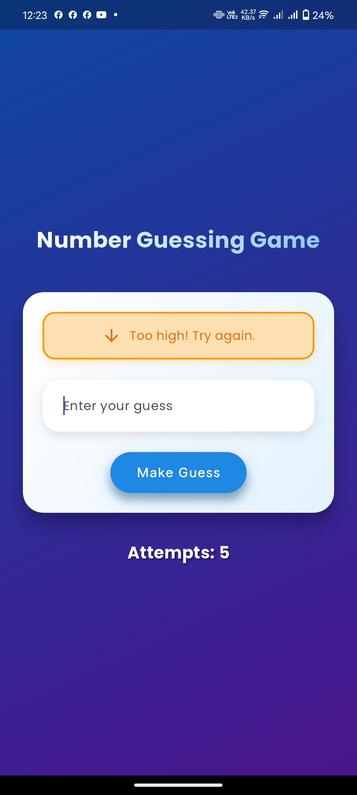
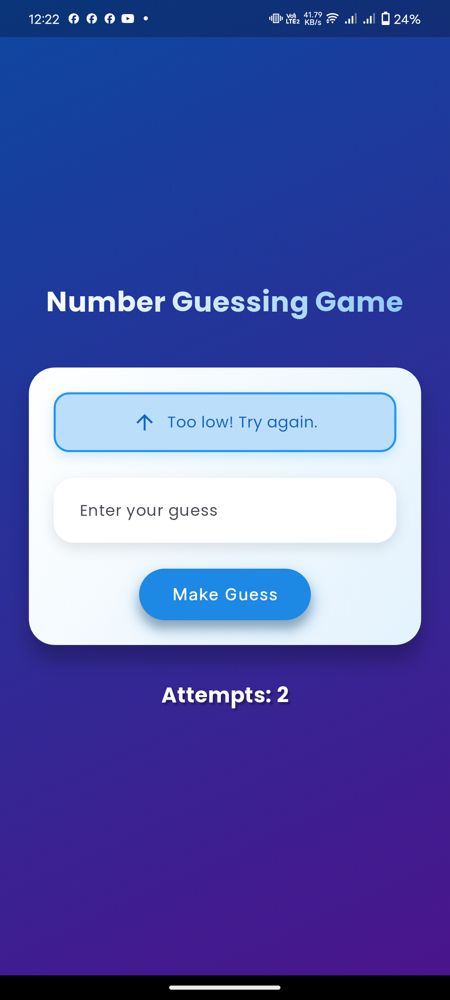
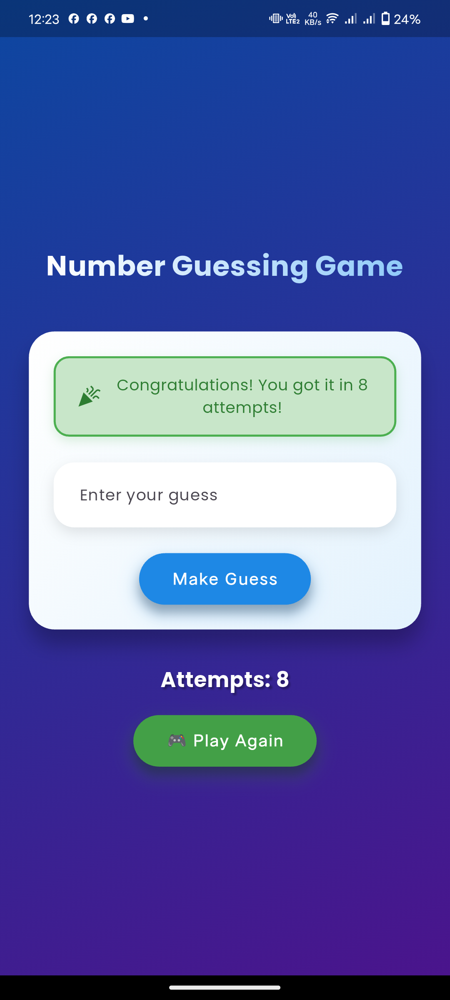
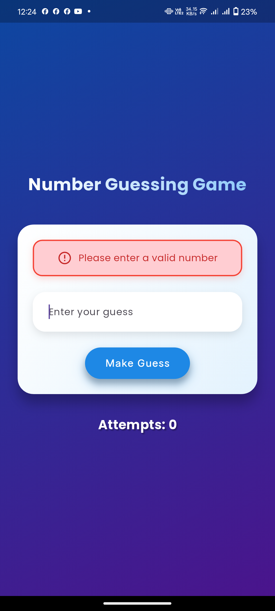

# Flutter Number Guessing Game 🎮

A beautiful and interactive number guessing game built with Flutter, featuring smooth animations and an engaging user interface.

## 🎯 Features

- Clean and modern UI design
- Smooth animations and transitions
- Color-coded feedback messages
- Attempt tracking
- Responsive design
- Separated business logic from UI

## 📱 Screenshots

| Main Screen | High Number | Low Number | Success State | Invalid Input State |
|---|---|---|---|---|
|  |  |  |  |  |